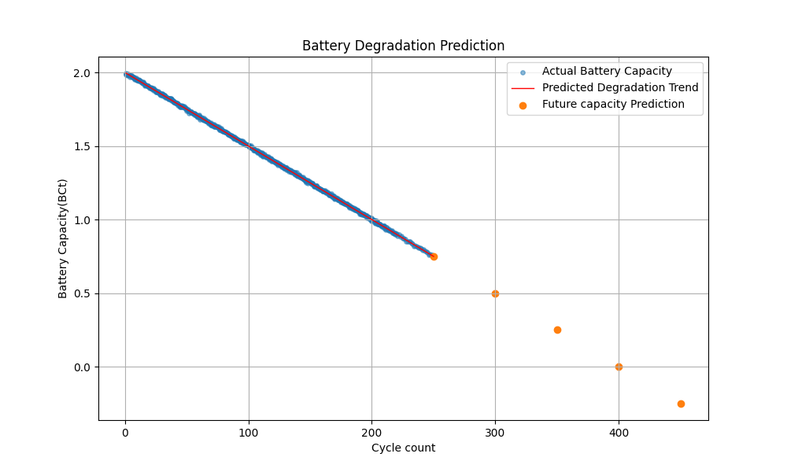

# Battery Degradation Prediction

## Project Overview

This project analyzes battery degradation using battery cycle data and Linear Regression. The objective is to understand how battery capacity changes with increasing cycle count and estimate future battery capacity values.

## Dataset

The dataset contains battery operational and health information including:

* battery_id
* cycle
* BCt (Battery Capacity)
* SOH (State of Health)
* RUL (Remaining Useful Life)
* Current measurements
* Voltage measurements
* Temperature measurements

For this project, the variables used are:

* cycle → Input feature
* BCt → Target variable (Battery Capacity)

## Tools and Libraries

* Python
* Pandas
* NumPy
* Matplotlib
* Scikit-Learn

## Methodology

1. Load battery cycle data from a CSV file.
2. Select battery cycle number (`cycle`) as the input feature.
3. Select battery capacity (`BCt`) as the target variable.
4. Train a Linear Regression model using the battery data.
5. Predict battery capacity for future cycle counts:

   * 250
   * 300
   * 350
   * 400
   * 450
6. Visualize the actual battery capacity data, degradation trend, and future capacity predictions.

## Results

### Battery Degradation Trend

The blue markers represent the actual battery capacity measurements from the dataset.

The red line represents the degradation trend learned by the Linear Regression model.

The orange markers show the predicted battery capacity for future cycle counts.

The results indicate a decrease in battery capacity with increasing cycle count, demonstrating the degradation behaviour captured by the regression model.

## Key Learning Outcomes

* Data loading and preprocessing using Pandas
* Data visualization using Matplotlib
* Linear Regression using Scikit-Learn
* Battery degradation trend analysis
* Future capacity prediction using a trained regression model

## Files

* `Battery_Degradation_Prediction.py`
* `Battery_Degradation_Prediction.ipynb`
* `Battery_dataset.csv`
* `battery_degradation_prediction.png`

## Future Improvements

Possible future enhancements include:

* Using larger battery datasets
* Comparing multiple regression models
* Applying polynomial regression
* Improving long-term degradation prediction accuracy
